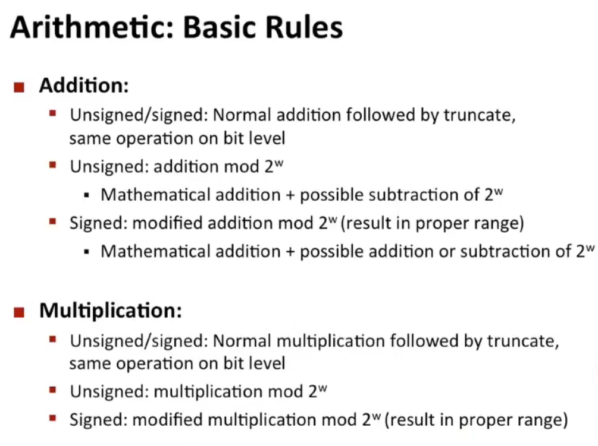
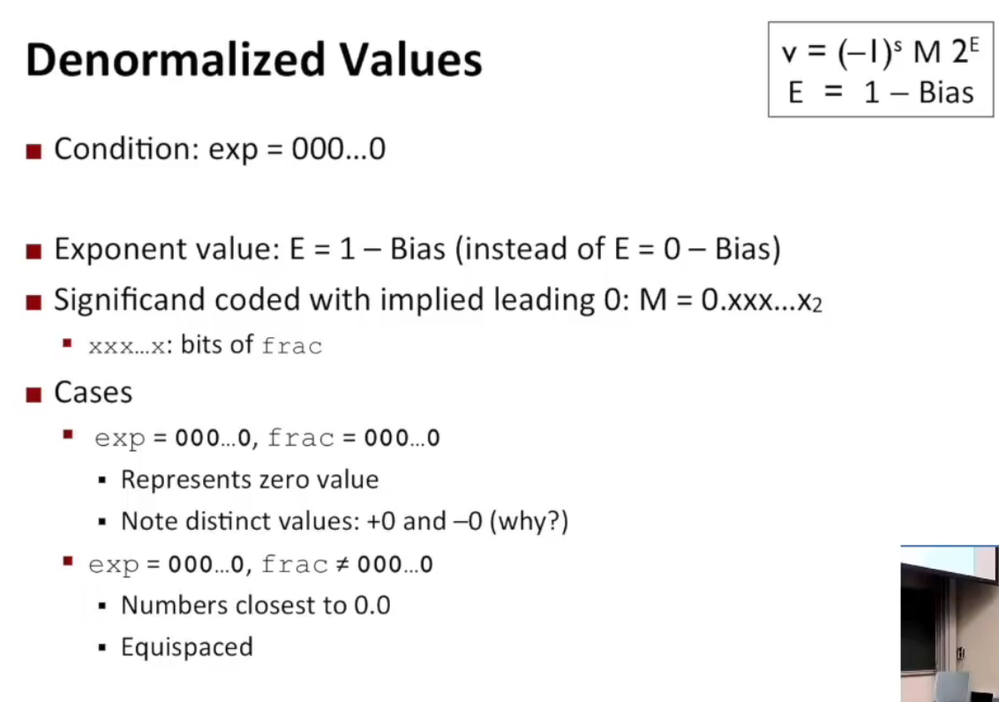
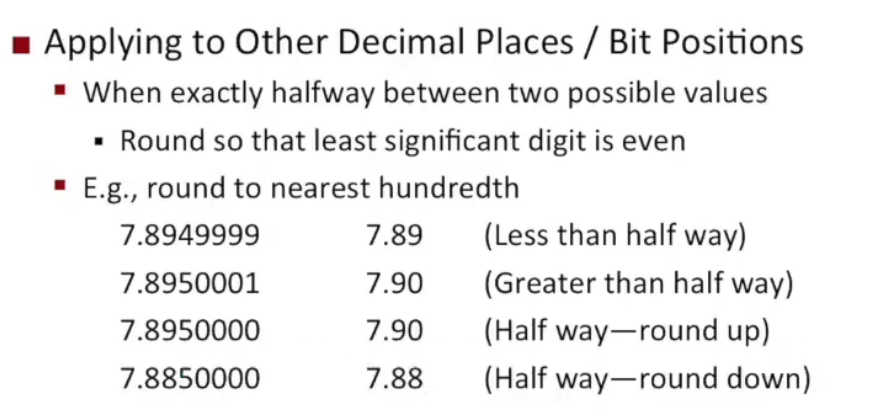
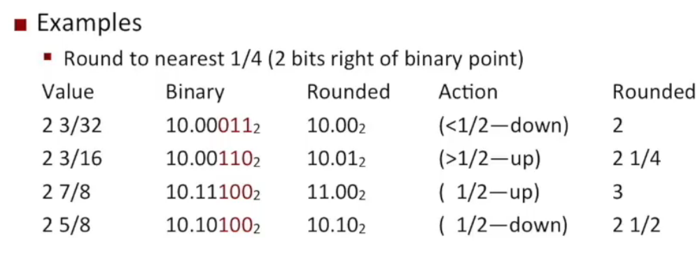
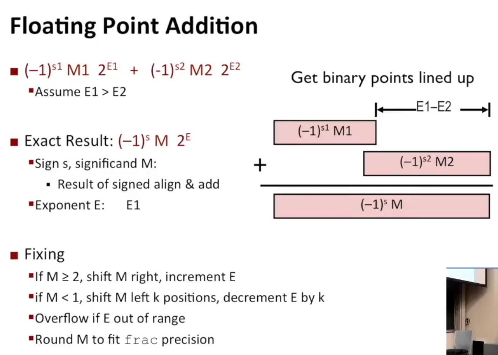

# Chapter 1 数据的表示
## Bits, Bytes and Integers
### Bit-level manipulation
#### 1. **Boolean Algebra**
   - AND: & (intersection)
   - OR: | (union)
   - NOT: ~ (complement)
   - XOR: ^ (异或) (symmetric difference)

>***注意***：不要和C语言中的&&,||和！混淆，后者将一切nonzero视为true，而且只返回1或0：!0x69 && 0x55 = 0x01
**同时**，C语言中的&&,||和！都有Early termination功能，即如果前面的表达式已经可以确定结果，则后面的表达式将不再计算; `p && *p` 也可以避免空指针访问
<br/>

#### 2. **Shift Operation**
   - **left shift**: << (bitwise left shift)
     - shift bit-vector x left y positions, throw away extra bits on left, and fill 0's on right 
   - **right shift**: >> (bitwise right shift)，fill 0's on right
   - **arithmetic right shift**: >>> replicate most significant bit on left
      > example:1010 >> 1 = 1101(1010右移一位，最高位保持不变)
   - **undifined behaviour**: shift amount<0 or shift amount$\geq$word size

---
  
### Integers and Integers arithmetic
#### 1. **Unsigned and 2's Complement**
   - **Unsigned**：$B2T(X) = \sum_{i=0}^{w-1} x_i\cdot2^i$
   - **2's Complement**：$B2T(X) = -x_{w-1}\cdot2^{w-1}+\sum_{i=0}^{w-2} x_i\cdot2^i$
   1. 之所以称作2的补码，是因为通过将最高位代表的数设为负,如此最高位为1则计算出负数
   2. 同时注意到，当二进制数各位全为1时，最高位代表的数比其余位相加多1，即$(111111)_{2's Complement}=-1$
   3. 如此，就可以解释为何2补码的计算方法是**取反加1加负号**了：全部取反，这样与原数相加后就变成全为1；再加上1，刚好抵消最高位$-2^{w-1}$，也就算出了最高位与低位的差；再加上负号，即与原始公式计算出来的结果相同了
   4. 同时，对$x$**取负**的方法是**取反加1**
   
>**how to pronounce:** *$2^{w-1}$---- two to the word size minus 1*
<br/>

#### 2. **原码与补码的关系**：
$B2U(X)=B2T(X)+bit_{w-1}\cdot2\cdot2^{w-1}(此消彼长)=B2T(X)+bit_{w-1}\cdot2^w$
<br/>

#### 3. **Numeric Ranges**
   **Unsigned:** $min=0,max=2^{w}-1$
   **2's Complement:** $min=-2^{w-1},max=2^{w-1}-1$
   - $U_{max}=2\cdot T_{max}+1  :011111\cdot2=111110$(shift left by 1)
*tips*: by default 默认情况下
<br/>

#### 4. **Expression Evaluation（表达式求值）**
   表达式里有TU混合，就要全部转换成U：
   > ***If there is a mix of unsigned and signed in single expression, signed values implicitly cast to unsigned.***

   - 包括比较运算,例：
      > 0==0U
      -1<0
      -1>0U(11111转换成unsigned)
   - C语言编程可能出现的问题：
     ```{.line-numbers}
      unsigned i;
	   for(i=20; i>=0; i--){
		printf("hello\n");
      }
      ```
      这样会进入死循环，因为unsigned会从0跳到Umax;
     ```{.line-numbers}
      int i;
      for(i=20; i-sizeof(int)>=0; i--){
		printf("hello\n");
	   }
      ```
      同样会进入死循环，因为sizeof()返回的是unsigned类型，表达式默认切换为unsigned类型运算
<br/>

#### 5. **Sign Extension**
- **unsigned**: 原bit不变，高位补0；


- **2's Complement**: make k copies of sign bits: 1101(扩展k位)-->111101
   > 如果看到一个数高位是：FFF…F，肯定是负数
<br/>

#### 6. **Sign Truncating**
- **unsigned**: 模运算——原数mod原数但剩余位全0
> 101011（43）缩1位：01011（11）——$43mod32((100000)_2)$;
> 111011（59）缩2位：1011（11）——$59mod48((110000)_2)$
>

- **2's Complement**:

#### 7. **Addition**
**unsigned:** Ignores carry output
  $s = UAdd_w(u,v) = (u+v)\,mod \,2^w$
  > $1101+0101=10010\xrightarrow{cast}0010=2=(5+13)\,mod\,16$

   上面的现象称为溢出（overflow）：
.png "unsigned_overflow(1)")
.png "unsigned_overflow(2)")
**2's Complement**
   - 补码加法与原码加法类似，也可以通过补码加法进行减法运算（如$5-3=5+(-3)=0101+1011=1110=-2$）
   - 同样，补码也会有溢出，但是分为正溢出和负溢出,如：
      > negative overflow：$1101+1010=0111(-3+-6=7)$
       positive overflow：$0111+0101=1100111(7+5=-4)$

.png "unsigned_overflow(1)")
.png "unsigned_overflow(2)")
<br/>


#### 8. **Multiplication**
**unsigned:** $UMul_w(u,v) = (u\cdot v)\,mod \,2^w$

**2's Complement:**
   - truncating 后最高位决定了最终结果是否为负数，因此会出现正数相乘得负数的情况，如:
      >$5\times5=00011001=1001=-7$
   - 但是，将补码转换为原码后做乘法，最终的结果仍正确，如:
      >$1101(-3/13)\times1110(-2/14)=...0110=6(-3\times-2)/182(13\times14)$
      $1101(-3/13)\times0010(2)=00011010(26)=1010(-3\times2)$

<br/>

#### 9. **Power-of-2 Operations with Shifts**
1. **Power-of-2 Multiply with Shifts**
$u << k = u * 2^k$ for both unsigned and 2's Complement
2. **Power-of-2 Divide with Shifts**
   **unsigned**: $u >> k = u / 2^k$, using logical shift
   **2's Complement**：arithmetic shift
      > $-6/2=1010>>2_(arithmetic)=1101(-3)$

      但是，
      > $-3/2=1101>>2_(arithmetic)=1110(-2)$

      此时并没有向0舍入，而是向负无穷舍入，因此需要加一个bias（偏移量）：
      > $(-3+1)/2=1110>>2_(arithmetic)=1111(-1)$




<br/>

#### 10. **Counting Down with Unsigned**

#### 11. **examples**
---

### Floating Point
#### 1. **Representatin**
1. **Numerical Form**: $(-1)^{S}\cdot M\cdot 2^E$
   - S: sign bit (0 for positive, 1 for negative)
   - M: mantissa, siginificand that is normally a fraction value in range $[1.0, 2.0)$
   - E: exponent, weighing value by power of 2
  
2. **Encoding:**
   - MSB **s** is sign bit **S**
   - **exp** field encodes **E** (but is not equal to E)
   - **frac** field encodes **M** (but is not equal to M)
   > **single** precision: 1 sign bit, 8 exponent bits, 23 fraction bits
    **double** precision: 1 sign bit, 11 exponent bits, 52 fraction bits
 **extended** precision: 1 sign bit, 15 exponent bits, 63 fraction bits
3. **Normalized Representation:**
   - $exp\neq000...0\enspace and \enspace exp\neq111...1$ 
   - $E = exp - bias$
   - $bias = 2^{k-1}-1$, where k is the number of exponent bits
     - Single precision: 127  $(exp:1...254, E:-126...127)$
     - Double precision: 1023  $(exp:1...2046, E:-1022...1023)$
   - M=1.xxxxx...x, where **x** are bits of frac field(因为默认整数部分是1所以将其省略，还能多表示一个小数位)
     - Minimun when frac=000...0($M=1.0$) 
     - Maximum when frac=111...1($M=2.0-\varepsilon$)
> ***Example***: `float F = 15213.0`
   $\quad 15213.0_{10}=11101101101101_2=1.1101101101101\times2^{13}$
>  **Significand**:
>  $\quad M = 1101101101101_2$
>  $\quad frac = 11011011011010000000000_2$
>  **Exponent:**
>  $\quad E = 13$
>  $\quad bias=127$
>  $\quad exp=140=10001100_2$
> **Sign:**
> $\quad S =0 $
> **Result:**$\underbrace{0}_{s}\,\underbrace{10001100}_{exp}\,\underbrace{11011011011010000000000}_{frac}$
4. **Denormalized values:**

> you can't express 0 in normalized form for there's always a $1$ before .xxx...x

5. **Special Values:**
   - $exp=111...1, frac=000...0$
     - represents  $\infty$(infinity)
     - 当operation overflow时得到
     - 有$+\infty$和$-\infty$
     - 溢出后进行任何操作仍是$\infty$，不会回到正常范围，**which is different from 2's Complement case**
     - E.g., $1.0/0.0=-1.0/-0.0=+\infty,\quad1.0/-0.0=-\infty$
   - $exp=111...1, frac\neq000...0$
     - represents  $NaN$(Not-a-Number)
     - get when operation is undefined(e.g., take the square root of -1)
<br\>

#### 2. **Operations**
1. **Basic idea:**
   - first compute exact result
   - make it fit into desired precision
     - possibly overflow if exponent too large
     - possible **round** to fit into frac
2. **Rounding Rules:**
   - towards zero
   - round down($-\infty$)
   - round up($+\infty$)
   - round-to-nearest-even(default)
   - **IEEE:  小于最近偶数的一半，就向下舍入，大于则向上舍入，正好一半(halfway)就向最近偶数舍入**
      > e.g., $1.40\rightarrow1,\,1.5\rightarrow2,\,2.5\rightarrow2,\,-1.5\rightarrow-2$
     - 数字均匀分布，因此向上或向下舍入的概率相等
     - **怎样找到最近偶数：若舍入位为奇就加上half**
     - 举例：十进制下百分位精度舍入
      
      > 第三行7.895中舍入位为9是奇数，因此加上half=0.01(hundredth)/2=0.005，得到7.90
3. **Rounding Binary Numbers:**
   - "Even" when least significant bit is 0
   - "Halfway" when bits to right of rounding position = 100...0
   - Easier to get nearest even：舍入位为0罢了，为1就再加1
 

4. **Multiplication:**
   $(-1)^{s1}M_1\,2^{E_1}\times(-1)^{s2}M_2\,2^{E_2}$:
   - Exact result: $(-1)^{s}M\,2^{E}$
     - s: s1 ^ s2
     - M: $M_1\times M_2$
     - E: $E_1+E_2$
   - Fixing: 
     - If $M\geq2$, shift M right and increment E(M得是1点几)
     - If E out of range, overflow
     - Round M to fit frac presicion
5. **Addition:**
   根据E对齐，然后进行计算和fixing：
   

6. **Mathematical Properties of FP Add:**
   - 加法和乘法均满足交换律，不满足结合律(commutative but not associative)
     - Overflow and inexactness of rounding
      >e.g., $(3.14+1e10)-1e10=0, 3.14+(1e10-1e10)=3.14$，
      $(1e10\cdot1e10)\cdot1e-10=inf, 1e10\cdot(1e10\cdot1e-10)=1e10$
   - 除infinity和NaN外都有加法逆元
   - 除infinity和NaN外满足单调性(monotonicity)：$a\geq b\Rightarrow a+c\geq b+c, \quad a\geq b\,\&\, c\geq 0 \Rightarrow a\cdot c\geq b\cdot c$
   - 不满足乘法分配律
     - possibility of overflow and inexactness of rounding
     > e.g., $1e20\cdot(1e20-1e20)=0.0,\,1e20\cdot1e20-1e20\cdot1e20=NaN$
#### 3. **Floating Point in C**